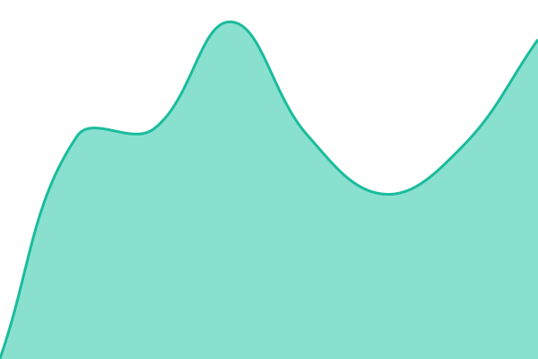
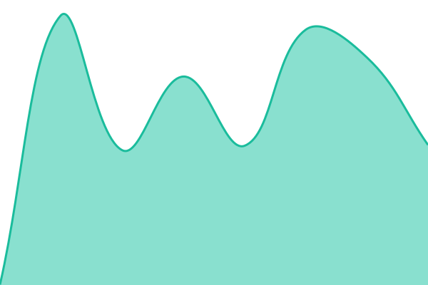

# [📈 Live Status](https://status.lasata.eu): <!--live status--> **Todos los sistemas operativos**

This repository contains the open-source uptime monitor and status page for [Rubén Castañeda Matute](https://rubencm.blogspot.com/), powered by [Upptime](https://github.com/upptime/upptime).

With [Upptime](https://upptime.js.org), you can get your own unlimited and free uptime monitor and status page, powered entirely by a GitHub repository. We use [Issues](https://github.com/lasatagameplays/status/issues) as incident reports, [Actions](https://github.com/lasatagameplays/status/actions) as uptime monitors, and [Pages](https://status.lasata.eu) for the status page.

<!--start: status pages-->
<!-- This summary is generated by Upptime (https://github.com/upptime/upptime) -->
<!-- Do not edit this manually, your changes will be overwritten -->
<!-- prettier-ignore -->
| URL | Status | History | Response Time | Tiempo de Actividad |
| --- | ------ | ------- | ------------- | ------ |
|  [Web Principal (LASATA)](https://lasata.eu) | Operativo | [web-principal-lasata.yml](https://github.com/lasatagameplays/Status-lasata.eu/commits/HEAD/history/web-principal-lasata.yml) | 

 1223ms
     
 | 

<a href="https://status.lasata.eu/history/web-principal-lasata">100.00%</a>
    

|  [Nube Privada (FileBrowser)](https://archivos.lasata.eu) | Operativo | [nube-privada-file-browser.yml](https://github.com/lasatagameplays/Status-lasata.eu/commits/HEAD/history/nube-privada-file-browser.yml) | 

 574ms
     
 | 

<a href="https://status.lasata.eu/history/nube-privada-file-browser">100.00%</a>
    

|  [Webmail (HestiaCP)](https://webmail.lasata.eu) | Operativo | [webmail-hestia-cp.yml](https://github.com/lasatagameplays/Status-lasata.eu/commits/HEAD/history/webmail-hestia-cp.yml) | 

 525ms
     
 | 

<a href="https://status.lasata.eu/history/webmail-hestia-cp">100.00%</a>
    

|  [Server S1 (HestiaCP)](https://s1.lasata.eu:8083) | Operativo | [server-s1-hestia-cp.yml](https://github.com/lasatagameplays/Status-lasata.eu/commits/HEAD/history/server-s1-hestia-cp.yml) | 

 1049ms
     
 | 

<a href="https://status.lasata.eu/history/server-s1-hestia-cp">2.29%</a>
    

<!--end: status pages-->

[**Visit our status website →**](https://status.lasata.eu)

## 📄 License

- Powered by: [Upptime](https://github.com/upptime/upptime)
- Code: [MIT](./LICENSE) © [Anand Chowdhary](https://anandchowdhary.com), supported by [Pabio](https://pabio.com)
- Data in the `./history` directory: [Open Database License](https://opendatacommons.org/licenses/odbl/1-0/)
